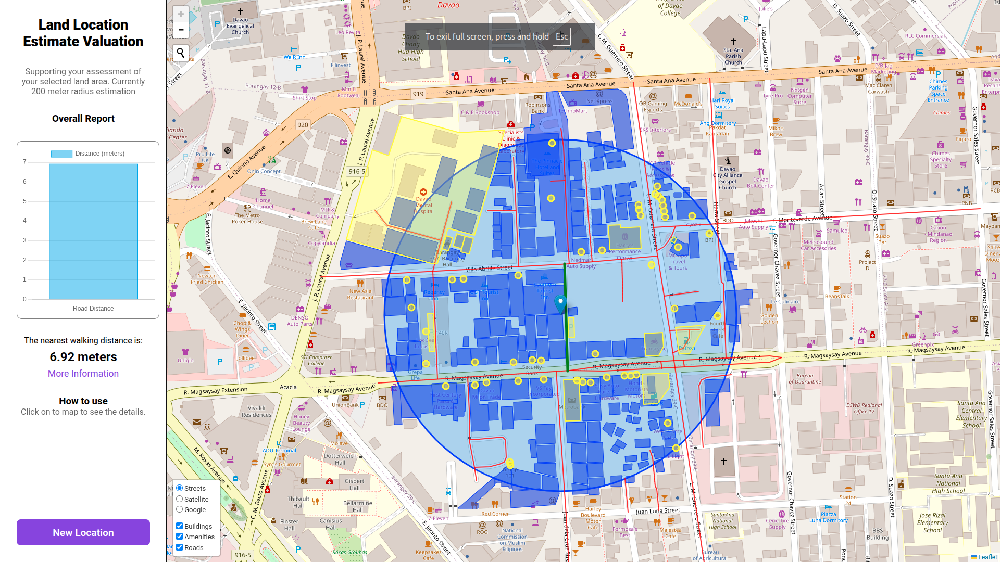

# Urban Location Assessment (Living Urban)

A platform for assessing urban livability, accessibility, and environmental risks using public geospatial data.

The project aims to make fragmented urban data in Southeast Asia more understandable and accessible starting in the Philippines. Instead of relying on assumptions when evaluating a location, users can explore data-driven insights about infrastructure, accessibility, urban density, and environmental risks.

---

## Overview

Many people purchase land, relocate, or invest in property without understanding the surrounding urban environment.

This project combines public geographic and environmental datasets into a single interactive assessment tool that helps users evaluate:

- Urban accessibilty
- Nearby Infrastructure and Services
- Population and activity Density
- Environmental Features
- Overall livavility of a location

---

### Who Is This For

#### Communities & Citizens

People who want better visibility into the quality and accessibility of their neighborhoods.

#### Property Buyers & Real Estate Investors

Individuals or organizations assessing land, housing, or commercial investment opportunities.

#### People/Business Relocating

Users comparing cities, municipalities, or neighborhoods before moving.

#### Researchers & Urban Planners

Developers, GIS professionals, and planners exploring public urban datasets.

### Key Features

- Interactive map-based urban assessment
- Uses public accessible geospatial datasets
- Calculates urban/rural scoring metrics
- Acessibilty and nearby infrastructure analysis
- Environment and disaster risk assessment
- Lightwieght self hosted

---

### Screenshot


`1st version`

---

### Techstack

#### Backend

- Python
- FastAPI - [Docs](https://fastapi.tiangolo.com/)
- uv package manager - [Docs](https://docs.astral.sh/uv/)

#### Frontend

- Vanilla HTML/JS/CSS
- Leaflet.js - [Docs](https://leafletjs.com/reference.html)
- Jinja Templates
- Chart.js - [Docs]

#### Infrastructure

- Docker
- VM/Self-hosted deployment

---

### Data Sources

This project focuses on publicly available datasets.

1. Open Street Map (OSM) [Read More]("https://wiki.openstreetmap.org/wiki/Overpass_API")
2. Public flood/landslide data A.K.A risk data (Soon)
3. Environment Remote Sensing (Slope, Elevation, Indicies) - (soon)

---

### Get Started

#### Prerequisites

- Python 3.13
- uv
- Docker(optional)

---

### Instalation

```
git clone https://github.com/joshdels/fastapi-leaflet-osm-landvalue
cd fastapi-leaflet-osm-landvalue
```

Install Dependecies using UV

```
uv sync
```

Run Deployment Server

```
fastapi dev app/main.py
```

---

### Project Structure

```
project/
├── .docker/
├── .github/
├── app/
│   └── routes/
│   └── scehma/
│   └── services/
│   └── static/
│       └── lib/
│       └── css/
│       └── js/
│   └── templates/
│       └── index.html
│   └── main.py/
├── public/
├── README.md
├── uv.lock
├── pyproject.toml
```

---

## Contributing

Contributions, feedback, and ideas are welcome.

### How to Contribute

1. Fork the repository
2. Create a new branch
3. Push the changes

```
git checkout -b feature/your-feature-name
git commit -m "Add: short description"
git push origin feature/your-feature-name
```

4. Open a Pull Request

---

### Developer Note:

This project is still experimental and evolving rapidly.
Alot of spaghetti code and newbie mistake (hehe).
Expect refactors in architecture, scoring systems, and data pipelines as the project grows.
To a better and accessible urban data for Southeast Asia, staring from Philippines.
*Joshua 2026*
